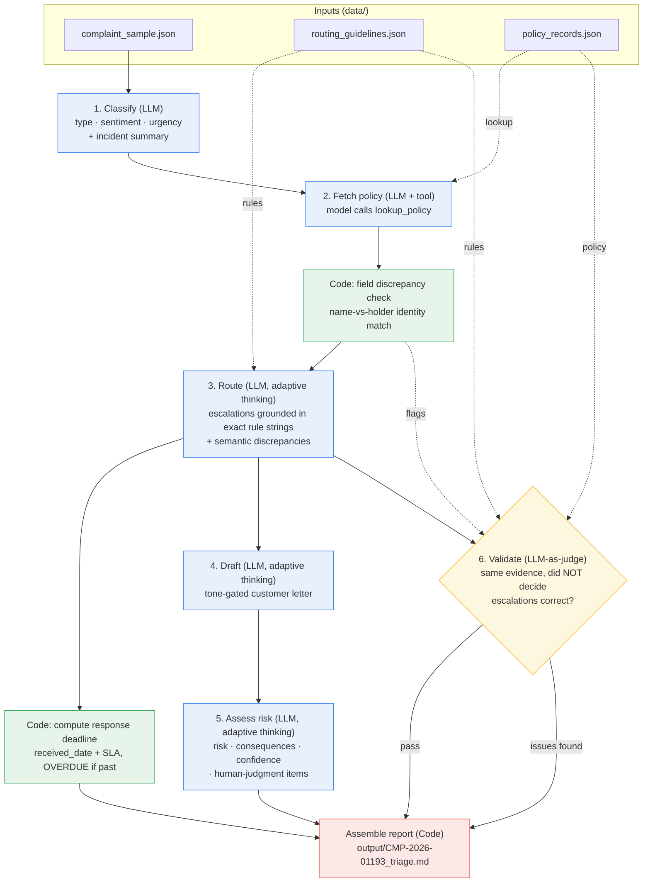

# Pipeline Architecture — Customer Complaint Triage

Pattern: prompt-chaining *workflow* (not an autonomous agent) with one tool-use
step, a deterministic spine, and an independent validation pass. The control flow
is fixed and code-driven, which is the right choice for a high-stakes, auditable
triage where every decision must be reproducible. Reasoning is done by
`claude-opus-4-8`; deterministic work (date math, structured-field comparisons,
report assembly) is kept in code.

## Stage-by-stage

| # | Stage | Kind | Output |
|---|-------|------|--------|
| 1 | Classify | LLM (no thinking) | `Classification` — type, sentiment, urgency, incident summary |
| 2 | Fetch policy | LLM + `lookup_policy` tool | policy record (captured deterministically from our own dispatch) |
| — | Field discrepancy check | **Code** | deterministic name-vs-holder identity flag |
| 3 | Route / escalate | LLM (adaptive thinking) | `EscalationResult` — the three escalations + exact rule strings + semantic discrepancies + response owner/path |
| — | Compute deadline | **Code** | SLA deadline string, marked `OVERDUE` when already past `now()` |
| 4 | Draft | LLM (adaptive thinking) | tone-gated customer letter (plain text) |
| 5 | Assess risk | LLM (adaptive thinking) | `RiskAssessment` — risk level, factors, consequences, confidence, human-judgment items |
| 6 | Validate | LLM-as-judge (adaptive thinking) | `ValidationResult` — escalations_correct, issues_found, assessment |
| — | Assemble report | **Code** | the markdown triage report |

## Why this shape

| Decision | Rationale |
|---|---|
| Workflow, not agent | The triage flow is identical for every complaint; a dynamic orchestrator would add cost and non-determinism for no benefit. Auditability > autonomy here. |
| **Deterministic checkpoints between LLM stages** | The single load-bearing reason to chain: code runs *between* probabilistic steps. The name-vs-holder identity check is an exact string comparison that **cannot** silently fail to fire; a single prompt could only be *asked* to check. On a triage where disclosing the wrong policyholder's details is a reportable PII breach, "provably ran" beats "usually noticed." |
| **Independent verification** | Stage 6 audits stage 3's escalations in a *separate* model invocation that never saw stage 3's reasoning — only the decisions and the same source evidence. This is structurally different from "model, check your own work," which rationalizes the answer it just produced. |
| Tool use for policy lookup | Demonstrates the grounded tool-use pattern. Honest caveat: this lookup is a deterministic fetch by primary key, so the model round-trip is illustrative — in production it would be a direct call. |
| Structured outputs (Pydantic) | Every LLM step returns a validated, typed object — no fragile text parsing, and `extra="forbid"` means the model cannot invent fields or categories outside the guidelines. |
| Code for deterministic work | Date arithmetic and field comparisons are where LLMs are weak and where a wrong value (a hallucinated SLA deadline) is dangerous. |
| Adaptive thinking | Enabled only on the judgment-heavy steps (route, risk, validation, draft); classification runs without it to stay fast and cheap. |

## Runtime robustness

- **Retries:** the SDK's built-in exponential backoff for 429 / 5xx is relied upon (not reimplemented); the retry budget is widened (`max_retries=4`) for a long multi-call pipeline.
- **Truncation headroom:** judgment stages run with raised `max_tokens` so a long reasoning trace cannot truncate the structured JSON mid-object (which would fail validation).
- **Fail-closed:** if a stage fails unrecoverably — an API error after retries, or a non-API error such as a Pydantic validation failure — the pipeline aborts on the named stage rather than half-writing a compliance report. Report assembly is deterministic and sits *outside* the error-handled block.
- **Path-independence:** all data/output paths are anchored to the repo root, so the pipeline runs correctly from any working directory.
